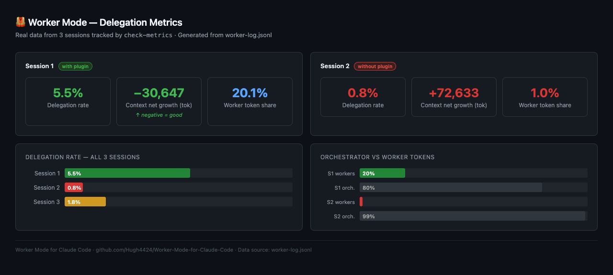

<div align="center">

# 🦺 Worker Mode for Claude Code

### Install once, delegate forever.

[](https://opensource.org/licenses/MIT)
[](http://makeapullrequest.com)

**English** · [中文](README.zh.md)

</div>

---

## What problem does this solve?

If you use Claude Code for long development sessions, you've probably hit this:

> **"My Opus usage is 20× my Sonnet usage. Why is my main session eating so many tokens?"**

The cause: **Claude's main session keeps doing all the heavy lifting itself** — reading large files, running grep 100+ times, editing code — instead of dispatching sub-agents. Everything piles into your most expensive model.

Real numbers from three actual sessions before this plugin:

| What the main session did | Measured |
|---|---|
| Delegation rate | **1–2% only** |
| Actions it did itself | **833–1,128 times** |
| Context bloat per session | **250k–370k tokens** → constant auto-compaction |
| Parallel sub-agent dispatches | **0** |

Three previous fixes were tried. All failed:

- **Hard blocks** (intercept the tool) → got routed around via "read in chunks," then reverted
- **Soft reminders** (nudge plugins) → 43 reminders sent, zero behavior change
- **Fixed-line-count rules** → misfired on the very instruction files Claude *should* read itself

The root cause: soft prompts get diluted in long contexts and get ignored. This plugin first tried the pure-incentive road (change the default instinct, intercept nothing) — and three real sessions proved it out: protocol-in-prompt and nudges alike were ignored, delegation stayed at ~0%. Seeing the reminder didn't change the behavior (self-correction blindspot).

**So the plugin enforces delegation structurally via tool-stripping.** The main session runs as the `coordinator` agent (via `settings.json` `agent` field), which physically has no Write/Edit/MultiEdit — the hands to write code are removed, so authoring must be delegated. A `PreToolUse` hook (`enforce-backend`) physically blocks Task calls routed to the wrong backend (not write/test-class tool calls — it gates which backend you dispatch *to*). A `PostToolUseFailure` hook (`detect-omc-failure`) writes a failure marker when a Task fails, preventing silent auto-fallback to the legacy backend. Reads, delegation (`Task`/`Agent`), and light Bash stay fully available.

---

## What it does

Install it, and your main Claude Code session adopts a **foreman mindset**: heavy reads, parallel tasks, and implementation work get dispatched to a crew of specialist sub-agents. The main session only scopes the work, collects summaries, and judges results. Its context stays light.

```
        BEFORE                                  AFTER
┌─────────────────────────┐         ┌─────────────────────────┐
│  Main session            │         │  Main session (foreman)  │
│  ├─ Read 30k-line file   │         │  ├─ reads light state    │
│  ├─ grep × 127           │         │  └─ dispatches ↓         │
│  ├─ git show × 219       │         └──────────┬──────────────┘
│  ├─ Edit × 13            │            ┌────────┼────────┐
│  └─ context: 370k 💥     │         file-reader  impl   reviewer
│     (compaction loop)    │         (heavy reads happen in workers;
└─────────────────────────┘          only summaries return)
```

---

## See it in action



Run `check-metrics` after a session to see what actually got delegated:

```
$ node tools/check-metrics.mjs --log ~/.claude/worker-log.jsonl

Delegation metrics (18 sessions)

[best session]  ← with plugin, well-configured
  delegation rate:       27.6%
  worker tokens:         1,069,757 tok (74% of total)  ← heavy work in workers
  orchestrator tokens:   375,877 tok   (26%)
  context net growth:    +3,316 tok    ← barely moved
  worker time ratio:     82%

[typical session]  ← without plugin
  delegation rate:       0.9%
  worker tokens:         12,972 tok    (1% of total)
  orchestrator tokens:   982,699 tok   (99%)  ← everything in main context
  context net growth:    +87,972 tok   ← ballooning
  worker time ratio:     37%
```

Full output saved in [`assets/demo-output.txt`](assets/demo-output.txt).

---

## The crew

6 specialist workers + 1 foreman. The main session reads each worker's `description` to decide who to dispatch — no hardcoded assignment table. Add a new worker, write its description, routing grows on its own.

| Worker | Dispatch when you need to… |
|---|---|
| 🔎 `researcher` | look up docs, API refs, multi-source fact-checking |
| 📖 `file-reader` | read large files or long logs — too heavy for the main context |
| 🛠️ `implementer` | write new code or modify files |
| 🔬 `reviewer` | independently review a deliverable before accepting it |
| ✅ `qa` | run tests, verify acceptance, collect evidence |
| 🩹 `fixer` | reproduce → root-cause → patch a finding or test failure |
| 🦺 `coordinator` | the foreman — full tools, dispatches the crew (this is what the main session becomes) |

---

## Quick start

**1. Clone into your Claude agents directory:**

```bash
git clone https://github.com/Hugh4424/Worker-Mode-for-Claude-Code ~/.claude/Worker-Mode-for-Claude-Code
```

**2. Set the one required env var:**

```bash
export WORKER_LOG_PATH=/abs/path/to/worker-log.jsonl
```

Add this to your `~/.zshrc` (or `~/.bashrc`) so it persists across terminal sessions. Missing it? The plugin tells you loudly instead of silently writing somewhere wrong. (This config check never blocks the session.)

**3. Wire the agents in (one-time):**

```bash
bash scripts/setup-delegation-workers.sh
```

**4. Use Claude Code normally.** The main session delegates on its own. Every sub-agent run is recorded automatically on `SubagentStop`. Nothing extra needed.

---

## Check if it's working

Two post-hoc CLIs — one-shot, never resident, zero overhead during tasks.

```bash
# What got delegated (reads the worker-log)
node tools/check-metrics.mjs --log $WORKER_LOG_PATH

# What the foreman carried itself that it should have dispatched
# transcript.jsonl = Claude Code session file, found at ~/.claude/projects/{project}/
node tools/check-context-health.mjs {transcript.jsonl}
```

`check-metrics` shows what went **out**. `check-context-health` shows what **stayed in** — reads the foreman did itself that it could have delegated. Together they tell the full story.

---

## How enforcement works

This plugin started as pure-incentive: change the default instinct, intercept nothing. Three real sessions proved that road dead — protocol-in-prompt and nudges were both ignored, delegation stayed at ~0%. The orchestrator *saw* the reminders and didn't change (self-correction blindspot). A `PreToolUse` deny-hook was tried next but misfired on git commits, stderr redirects, and other write-shaped Bash — too many false positives.

**Current mechanism: tool-stripping + backend routing enforcement.**

- **Tool-stripping (primary):** The main session runs as the `coordinator` agent (`settings.json` `agent` field → coordinator's `tools` allowlist). `Write`/`Edit`/`MultiEdit` are physically absent — the foreman literally can't write code itself; it has to delegate.
- **Backend enforcement (`enforce-backend` hook, `PreToolUse` on Task/Agent):** Physically blocks Task calls routed to the wrong backend. This is *not* about blocking write operations — it gates which execution backend you dispatch *to* (OMC agents vs. legacy agents). Set `WORKER_MODE_BACKEND=legacy` to use the legacy worker crew instead of the default OMC backend.
- **Fail-stop (`detect-omc-failure` hook, `PostToolUseFailure` on Task/Agent):** When a Task call fails, writes an `omc-failure.marker` file. `enforce-backend` then blocks Task calls that would auto-fallback to the legacy backend — retrying by dispatching an OMC agent again is still allowed. To clear the marker and resume normally, set `WORKER_MODE_BACKEND=legacy` or run `node tools/clear-failure-marker.mjs`. This prevents silent auto-fallback, not all retries.

**fail-stop boundary — be honest about what's covered:**
- **Covered (tool-level failures):** Task call itself errors → `PostToolUseFailure` fires → marker written → subsequent legacy fallback / wrong-backend Task calls are blocked; OMC retry is still allowed. This is physically automatic.
- **NOT covered (agent soft-failures):** OMC agent runs and returns normally but its result is wrong, incomplete, or "failed" in content. There is no reliable automatic signal for this — the hook never fires because the tool call *succeeded*. These require the foreman to catch during review. Do not assume all failures are automatically blocked.

**Backend switch:** `export WORKER_MODE_BACKEND=legacy` routes to the legacy worker crew (`agents/` directory). The SessionStart hook always tells you which backend is active at the top of each session.

---

## How is this different from other delegation skills?

There are other Claude Code tools that encourage sub-agent use. The key difference:

| | Other delegation skills | Worker Mode |
|---|---|---|
| **Activation** | You invoke it each session | Installed once, always on |
| **Mechanism** | A skill you call by name | Identity protocol injected into CLAUDE.md |
| **Persistence** | Resets between sessions | Survives context compaction via `settings-compact.json` |
| **Observability** | None | `check-metrics` + `check-context-health` CLIs |
| **Worker crew** | Usually none | 6 specialist workers included |

The short version: **it's not a skill you activate — it's a default instinct you install.**

---

## State file

`templates/project-state.md` is a fillable template that workers use to receive project context without the foreman having to re-explain everything each time. Copy it into your project root, fill in the blanks — workers self-fetch it on demand.

---

## When to skip it

**Don't install if:**
- Your sessions are mostly single-file edits or one-shot questions
- Your project is under ~500 lines total
- You're not on a Claude Pro/Max plan where Opus cost actually matters

This earns its keep on **long, multi-step sessions** where context bloat and token cost are real. If the above applies, the foreman protocol is overhead with no payoff — you can still use the coordinator agent's CLAUDE.md guidance as a pure-incentive nudge without the structural enforcement.

---

## License

MIT.
